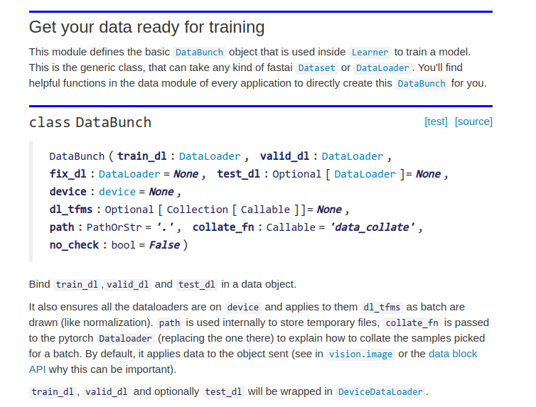
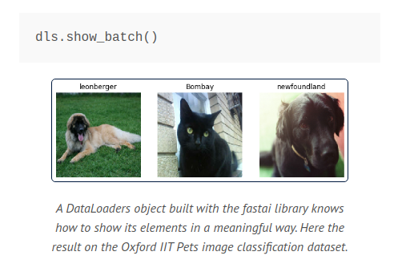
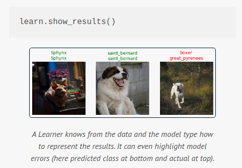

# 01_intro

These notes go in accordance with the following fast.ai book chapter notebook:

https://github.com/fastai/fastbook/blob/master/01_intro.ipynb

## New-Terms Glossary

- The _functional form of a model_ is called its _architecture_. This is the finished product.
- The _weights_ of a model are called its _parameters_.
- The _predictions_ are calculated from the _independent variables_:
  - -> The _data_ not including the _labels_
- The _results_ of the model are _predictions_
- The _measure of performance_ is called the _loss_
- The _loss_ depends not only on the _predictions_ but also on the _correct labels_
  - -> Also known as _targets_ or _dependent variables_, e.g. "dog" or "cat"

---

## Dissecting the first model

```py
from fastai2.vision.all import *
path = untar_data(URLs.PETS)/'images'

def is_cat(x): return x[0].isupper()

dls = ImageDataLoaders.from_name_func(
    path, get_image_files(path), valid_pct=0.2, seed=42,
    label_func=is_cat, item_tfms=Resize(224))

learn = cnn_learner(dls, resnet34, metrics=error_rate)
learn.fine_tune(1)
```

The important bits here are the `ImageDataLoaders` and `cnn_learner`.

---

### ImageDataLoaders

`ImageDataLoaders` is a type of a `DataLoader`, whose description taken from `fastai2/vision/data.py` is:

```py
class ImageDataLoaders(DataLoaders):
    "Basic wrapper around several `DataLoader`s with factory methods for computer vision problems"
```

> _"This line sets up the `DataLoaders` object. This is an abstraction that represents a combination of training and validation data."_

So `ImageDataLoaders` is a higher-level abstraction for setting up training and validation data from images. If we dive into the argument API for [ImageDataBunch.from_name_func](https://docs.fast.ai/vision.data.html#ImageDataBunch.from_name_func), we see:

```py
def from_name_func(path:PathOrStr, fnames:FilePathList, label_func:Callable, valid_pct:float=0.2, seed:int=None, **kwargs)
```

> _"Works in the same way as ImageDataBunch.from_name_re, but instead of a regular expression it expects a function that will determine how to extract the labels from the filenames. (Note that from_name_re uses this function in its implementation)."_

- We are passing the `path` object returned by `untar_data(URLS.PETS/'images')`, as our first argument:

  > _"Download url to fname if dest doesn't exist, and un-tgz to folder dest. If you have run untar_data before, then running untar_data(URLs.something) again will just return you dest without downloading again."_

- Our second argument, `fnames` of type `FilePathList`, comes from the function `get_image_files(path)`:

  > _"Return list of files in c that are images. check_ext will filter to image_extensions."_

- The third argument is the **_percentage of data_** to hold back from the training data as validation tests. The book has this to say about the importance of this argument:

  > The most important parameter to mention here is `valid_pct=0.2`. This tells fastai to hold out 20% of the data and _not use it for training the model at all_. This 20% of the data is called the _validation set_; the remaining 80% is called the _training set_. The validation set is used to measure the accuracy of the model. By default, the 20% that is held out is selected randomly. The parameter `seed=42` sets the _random seed_ to the same value every time we run this code, which means we get the same validation set every time we run this code--that way, if you change your model and re-train it, you know that changes are due to your model, not due to having a different random validation set.

- The fifth argument is the **_label function_**, which is used to **_tell the model how to determine which images should be labeled as what_**. In this model, we label as either a cat, or not cat, [though other similar examples for `fast.ai` use a RegEx labeler to label this same dataset by breed according to filename](https://www.fast.ai/2020/02/13/fastai-A-Layered-API-for-Deep-Learning/#vision).

  > The pets dataset contains 7390 pictures of dogs and cats, consisting of 37 different breeds. Each image is labeled using its filename, for instance the file great_pyrenees_173.jpg is the 173rd example of an image of a great pyrenees breed dog in the dataset. The filenames start with an uppercase letter if the image is a cat, and a lowercase letter otherwise. We have to tell fastai how to get labels from the filenames, which we do by calling from_name_func (which means that filenames can be extracted using a function applied to the file name), and passing `x[0].isupper()`, which evaluates to True if the first letter is uppercase (i.e. it's a cat).

- Our sixth argument is a Tranform to apply to the batch of images. We can alter the image data using transforms prior to training our model.

  > Finally, we define the `Transform`s that we need. A `Transform` contains code that is applied automatically during training; fastai includes many pre-defined `Transform`s, and adding new ones is as simple as creating a Python function. There are two kinds: `item_tfms` are applied to each item (in this case, each item is resized to a 224 pixel square); `batch_tfms` are applied to a _batch_ of items at a time using the GPU, so they're particularly fast (we'll see many examples of these throughout this book).

  > Why 224 pixels? This is the standard size for historical reasons (old pretrained models require this size exactly), but you can pass pretty much anything. If you increase the size, you'll often get a model with better results (since it will be able to focus on more details) but at the price of speed and memory consumption; or vice versa if you decrease the size.

<details>
  <summary>🗒 Notes on Important of Validation Data & the Overfitting Problem 👇</summary>

Models produced with fast.ai will show you their accuracy using _only_ validation data. The book discusses why this is so important:

> This is absolutely critical, because if you train a large enough model for a long enough time, it will eventually learn to _memorize_ the label of every item in your dataset! This is not actually a useful model, because what we care about is how well our model works on _previously unseen images_

> Even when your model has not fully memorized all your data, earlier on in training it may have memorized certain parts of it. As a result, the longer you train for, the better your accuracy will get on the training set; and the validation set accuracy will also improve for a while, but eventually it will start getting worse, as the model starts to memorize the training set, rather than finding generalizable underlying patterns in the data. When this happens, we say that the model is _over-fitting_.

Over-fitting is a **_regression from the ability to generalize_**. Rather than creating an adaptable model which can correlate novel inputs to patterns, an overfitted model has specialized itself to it's own training data and lost it's usefulness.

The authors give an example of an overfit model trained on randomized data based on the function `x^2`, where it can no longer see the general trend and molds the curve to fit it's own data:


</details>

Documentation from fast.ai V1 about `DataBunch` provides some information about this class of modules:

<details>
  <summary>📘 Show Documentation 👇</summary>



</details>

Some notes about `DataLoaders` and `learn`:

<details>
  <summary>🗒 Show Notes 👇</summary>

- `DataLoaders.show_batch()` can be used to display batch images in-notebook:
  

- `learn.show_results()` can used to to display model predictions and actual classifications:
  

</details>
